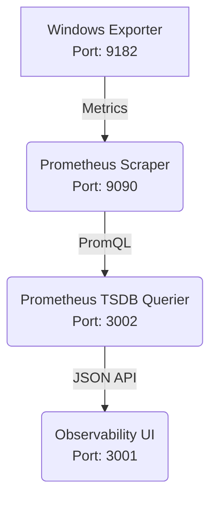
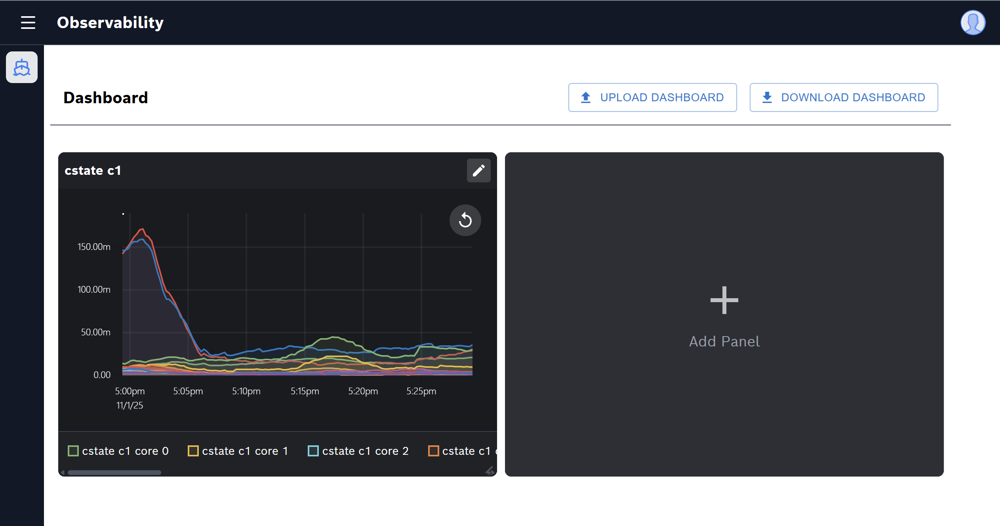
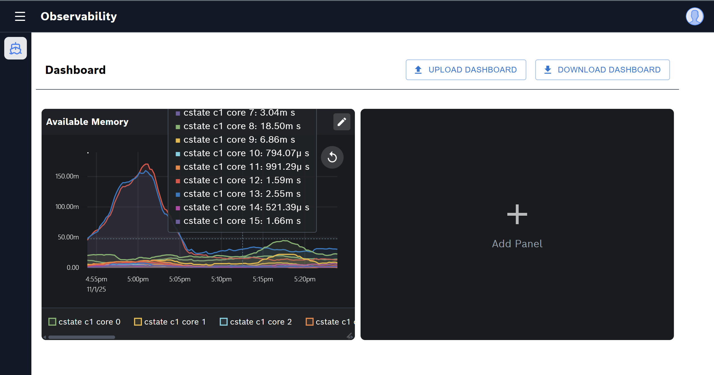
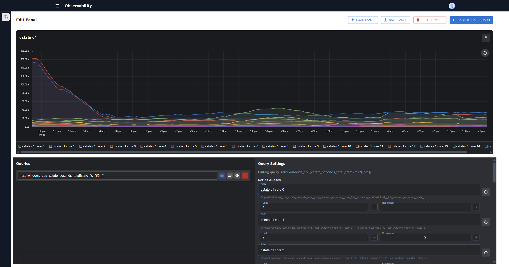
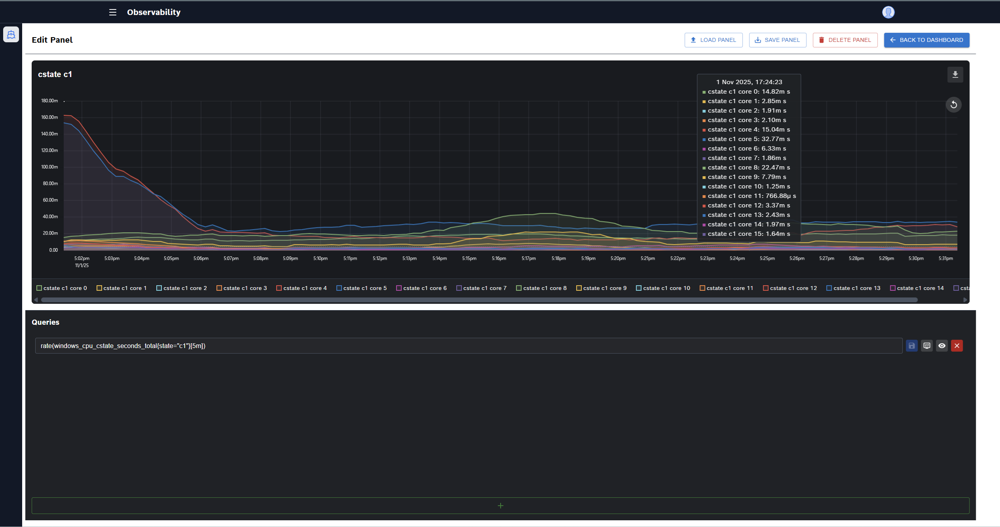

# Observability UI

This project is a modern, responsive user interface designed for visualizing observability data, built with React, TypeScript, and Vite. It provides a dynamic dashboard where users can create, arrange, and configure panels to display metrics and time-series data queried from a backend system.

## Architecture

The Observability UI is the presentation layer of a larger monitoring stack. The data flows as follows:



1.  **Windows Exporter**: Gathers metrics from Windows machines.
2.  **Prometheus Scraper**: Collects and stores the metrics from the exporter.
3.  **Prometheus TSDB Querier**: An intermediary service on port `3002` that queries the Prometheus Time-Series Database (TSDB) and exposes the data to the frontend via a JSON API.
4.  **Observability UI**: This application, running on port `3001`, which queries the backend and renders the data in customizable dashboards.

## Features

- **Dynamic Dashboard**: A fully configurable grid-based dashboard using `react-grid-layout`.
- **Customizable Panels**: Add, remove, and resize panels to suit your needs.
- **Chart Visualization**: Each panel can render charts to visualize query data.
- **State Persistence**: Download the current dashboard layout and panel configuration as a JSON file.
- **Upload Configuration**: Upload a previously saved JSON file to restore a dashboard state.
- **Responsive Design**: A collapsible sidebar and responsive layout for various screen sizes.
- **Modern Tech Stack**: Built with React, TypeScript, Vite, Redux Toolkit, and Tailwind CSS for a fast and maintainable developer experience.
- **Dark Theme**: A sleek, modern dark theme is applied across the application.

## Screenshots

Here's a glimpse of the Observability UI in action.

### Dashboard View

The main dashboard, showcasing multiple panels with different metrics.




Resizable panels in dashboard

### Panel Edit View

The detailed view for editing a single panel, including its queries and display settings.





## Tech Stack

- **Framework**: React
- **Build Tool**: Vite
- **Language**: TypeScript
- **Styling**: Tailwind CSS
- **UI Components**: Material-UI
- **State Management**: Redux Toolkit
- **Routing**: React Router
- **Grid System**: React Grid Layout

## Getting Started

Follow these instructions to get a copy of the project up and running on your local machine for development and testing purposes.

### Prerequisites

You need to have Node.js (version 18.x or later) and a package manager like npm or Yarn installed on your system.

### Installation

1.  **Clone the repository:**
    ```sh
    git clone <your-repository-url> Observability_UI
    cd Observability_UI
    ```

2.  **Install dependencies:**
    ```sh
    npm install
    ```

### Running the Project

To start the development server, run the following command. The application will be available at `http://localhost:5173` by default.

```sh
npm run dev
```